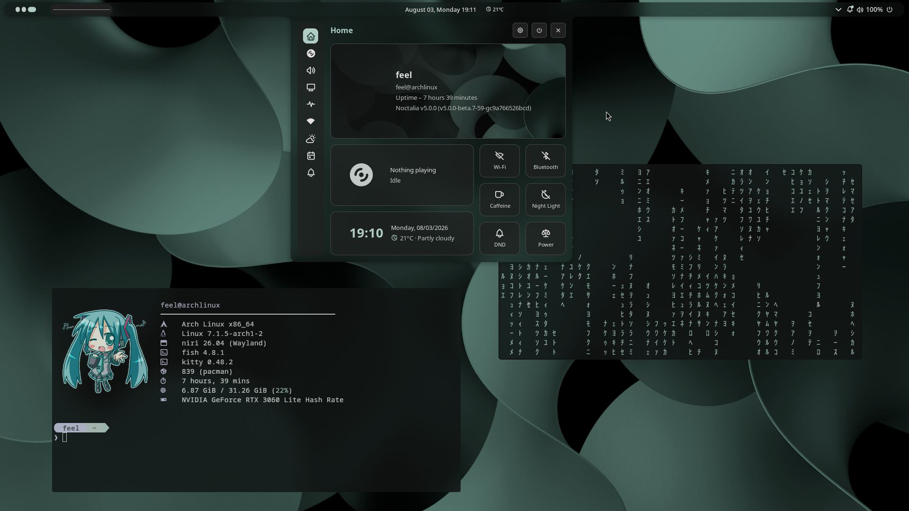

# Nind — Niri + Noctalia Dots

<small><sub>_Image for illustration purposes only. The look of the setup may change with future updates._</sub></small>
<p align="center">
  
</p>

<p align="center">
  Dotfiles for <b>Arch Linux + niri (Wayland)</b>, with a fully automated installation.
</p>

---

## About

**Nind** is my personal setup for **Arch Linux** using **Wayland**, the tiling compositor **niri**, and the **Noctalia v5** shell.

Besides the dotfiles, the project includes an installer (`install.sh`) capable of turning a minimal Arch installation into a fully functional desktop, installing packages, drivers, services, and copying all configuration files automatically.

<small><sub><b>Note:</b><br>
<i>The installation script was developed and tested by me on clean Arch Linux installations (Minimal DE).</i><br>
<i>It has also been reviewed to minimize possible issues during the installation of the dotfiles.</i><br>
<i>Still, if you prefer, you can skip the script and install or copy the dotfiles manually into your system.</i></sub></small>

## Features

- niri configured with Noctalia integration
- Noctalia v5 (shell, theming, and included wallpapers)
- Kitty
- Fish
- Neovim (LazyVim)
- Starship
- Fastfetch
- Zen Browser
- Cava
- `yay` support
- Automatic GPU driver installation (NVIDIA, AMD, or Intel)
- Automatic dotfiles installation
- Automatic backup of existing configs before installation

---

## What the installer does

`install.sh` runs in 11 steps:

1. Enables the `multilib` repository (needed for 32-bit libs, e.g. Steam).
2. Updates the system (`pacman -Syu`).
3. Installs `yay` (AUR helper), if not already present.
4. Installs base dependencies: niri, xwayland-satellite, terminal (Kitty), shell (Fish), fonts, XDG portals, Zen Browser, Noctalia (`noctalia-git`), matugen, Cava, and others.
5. Asks which GPU you have (NVIDIA / AMD / Intel) and installs the corresponding drivers. For NVIDIA, it also asks for the card's generation (open/current, legacy 580xx, or older legacy 390xx/340xx) and warns about the limited Wayland support of legacy drivers.
6. Backs up your current `~/.config` and `~/.local` before overwriting anything.
7. Copies this repository's dotfiles into `~/.config` and `~/.local`.
8. Installs and configures SDDM with a theme.
9. Enables the required services (SDDM, NetworkManager, PipeWire).
10. Optional step: lets you pick extra packages to install.
11. Wraps up: font cache, default shell (Fish), icon theme, and reboots the system.

---

## Requirements

- Arch Linux installed in **minimal** mode, with no prior graphical environment.
  If you want to install the dots on a machine that already has things set up, it's recommended to install the dots manually, following the niri and Noctalia v5 documentation.
- A regular user with `sudo` access (the script should not be run as root).
- An internet connection.

---

## Installation

After installing **Arch Linux**, run:

```bash
git clone https://github.com/feelyourwarmth/Nind.git
cd Nind
chmod +x install.sh
./install.sh
```

Do not run it with `sudo`. The script requests admin permissions on its own whenever needed.

Once it's done, the system reboots automatically and you'll be able to log into the niri session.

---

## Structure

```text
.
├── install.sh
├── .config
│   ├── niri/            # compositor config (niri + Noctalia integration)
│   ├── fish/             # shell
│   ├── kitty/            # terminal
│   ├── nvim/             # editor (LazyVim)
│   ├── gtk-3.0/ gtk-4.0/
│   ├── qt5ct/ qt6ct/
│   ├── fastfetch/
│   ├── starship.toml
│   └── wallpapers/
└── .local
    └── state/noctalia/   # Noctalia state and settings
```

niri's keybindings and settings are defined in:

```text
~/.config/niri/config.kdl
~/.config/niri/noctalia.kdl
```

---

## Notes

- The script overwrites `~/.config` and `~/.local`, but automatically creates a backup (`~/dots-backup-<date>`) before making any changes.
- Legacy NVIDIA drivers (390xx/340xx) have weak or nonexistent Wayland support — niri may not work correctly on those cards.
- At the end of the installation, the system reboots automatically after 5 seconds (press `CTRL + C` to cancel).
- Configurations are updated as I keep tweaking my own setup.

---

Made by me for daily use, but feel free to use, modify, and adapt it to your own needs.
