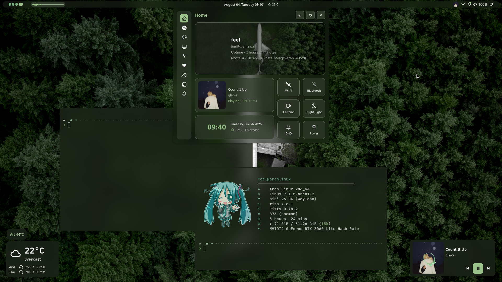

<h1 align="center">
  Nind Dots
</h1>
<p align="center">Dotfiles Altamente Configuráveis para Niri + Noctalia</p>

---

<small><sub>_Imagem apenas para fins ilustrativos. A aparência do setup pode mudar com futuras atualizações._</sub></small>
<p align="center">
  
</p>

<p align="center">
  Dotfiles para <b>Arch Linux + niri (Wayland)</b>, com instalação totalmente automatizada.
</p>

---

## Sobre

**Nind** é o meu setup pessoal para **Arch Linux** usando **Wayland**, o compositor em tiling **niri**, e o shell **Noctalia v5**.

Além das dotfiles, o projeto inclui um instalador (`install.sh`) capaz de transformar uma instalação mínima do Arch em um desktop totalmente funcional, instalando pacotes, drivers e serviços, e copiando todos os arquivos de configuração automaticamente.

> **Nota:** O script de instalação foi desenvolvido e testado em instalações limpas do Arch Linux (DE Mínima), e foi revisado para minimizar possíveis problemas durante a configuração. Ainda assim, se preferir, você pode pular o script e instalar ou copiar as dotfiles manualmente.

## Recursos

- niri configurado com integração ao Noctalia
- Noctalia v5 (shell, temas e wallpapers incluídos)
- Vicinae (Lançador de Aplicativos)
- Kitty
- Fish
- Neovim (LazyVim)
- Starship
- Fastfetch
- Zen Browser
- Cava
- Suporte ao `yay`
- Instalação automática de drivers de GPU (NVIDIA, AMD ou Intel)
- Instalação automática das dotfiles
- Backup automático das configurações existentes antes da instalação

---

## O que o instalador faz

O `install.sh` roda em 12 etapas:

1. Habilita o repositório `multilib` (necessário para bibliotecas de 32 bits, ex.: Steam).
2. Atualiza o sistema (`pacman -Syu`).
3. Instala o `yay` (AUR helper), caso ainda não esteja presente.
4. Instala as dependências básicas: niri, xwayland-satellite, terminal (Kitty), shell (Fish), fontes, portais XDG, Zen Browser, Noctalia (`noctalia-git`), matugen, Cava, entre outros.
5. Pergunta qual GPU você possui (NVIDIA / AMD / Intel) e instala os drivers correspondentes. Para NVIDIA, também pergunta a geração da placa (open/atual, legacy 580xx, ou mais antiga legacy 390xx/340xx) e avisa sobre o suporte limitado dos drivers legados ao Wayland.
6. Faz backup do seu `~/.config` e `~/.local` atuais antes de sobrescrever qualquer coisa.
7. Copia as dotfiles deste repositório para `~/.config` e `~/.local`.
8. Instala e configura o SDDM com um tema.
9. Habilita os serviços necessários (SDDM, NetworkManager, PipeWire).
10. Etapa opcional: permite escolher pacotes extras para instalar.
11. Instala o Vicinae.
12. Finaliza: cache de fontes, shell padrão (Fish), tema de ícones, e reinicia o sistema.

---

## Requisitos

- Arch Linux instalado em modo **mínimo**, sem nenhum ambiente gráfico prévio.
  Se você quiser instalar as dots em uma máquina que já tem coisas configuradas, é recomendado instalar as dots manualmente, seguindo a documentação do niri e do Noctalia v5.
- Um usuário comum com acesso `sudo` (o script não deve ser executado como root).
- Uma conexão com a internet.

---

## Instalação

Após instalar o **Arch Linux**, execute:

```bash
git clone https://github.com/feelyourwarmth/Nind.git
cd Nind

chmod +x install.sh
./install.sh
```

Não execute com `sudo` — o script solicita permissões de administrador por conta própria sempre que necessário.

Ao finalizar, o sistema reinicia automaticamente e você poderá fazer login na sessão do niri.

---

## Estrutura

```text
.
├── install.sh
├── .config
│   ├── niri/            # configuração do compositor (niri + integração Noctalia)
│   ├── fish/             # shell
│   ├── kitty/            # terminal
│   ├── nvim/             # editor (LazyVim)
│   ├── gtk-3.0/ gtk-4.0/
│   ├── qt5ct/ qt6ct/
│   ├── fastfetch/
│   ├── starship.toml
│   └── wallpapers/
└── .local
    └── state/noctalia/   # estado e configurações do Noctalia
```

Os atalhos de teclado e configurações do niri são definidos em:

```text
~/.config/niri/config.kdl
```

---

## Observações

- O script sobrescreve `~/.config` e `~/.local`, mas cria automaticamente um backup (`~/dots-backup-<data>`) antes de fazer qualquer alteração.
- Drivers NVIDIA legados (390xx/340xx) têm suporte fraco ou inexistente ao Wayland — o niri pode não funcionar corretamente nessas placas.
- Ao final da instalação, o sistema reinicia automaticamente após 5 segundos (pressione `CTRL + C` para cancelar).
- As configurações são atualizadas conforme eu vou ajustando meu próprio setup.

---

Feito por mim para uso diário, mas sinta-se à vontade para usar, modificar e adaptar às suas próprias necessidades.
